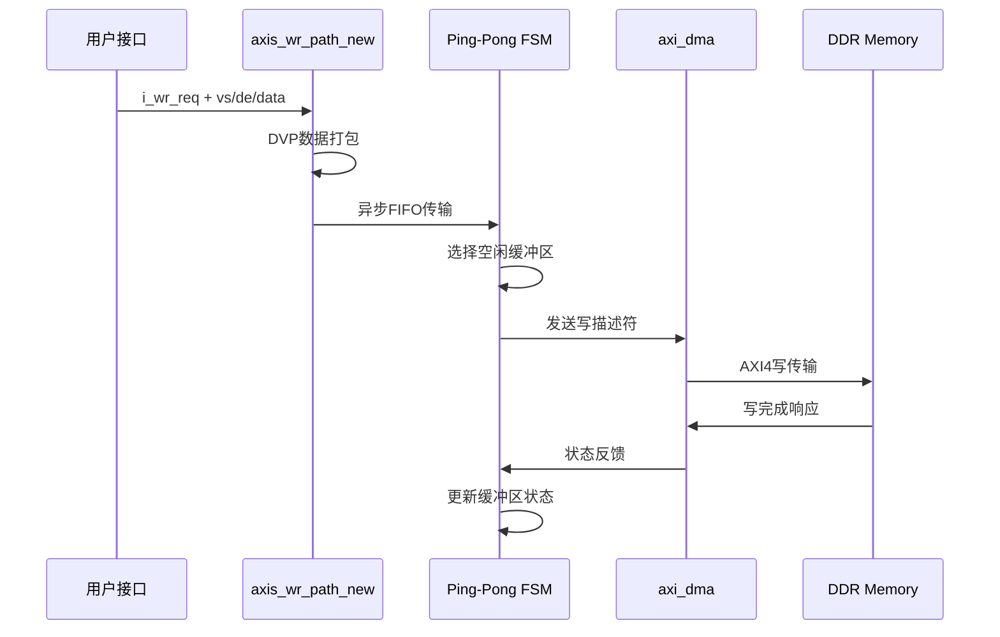
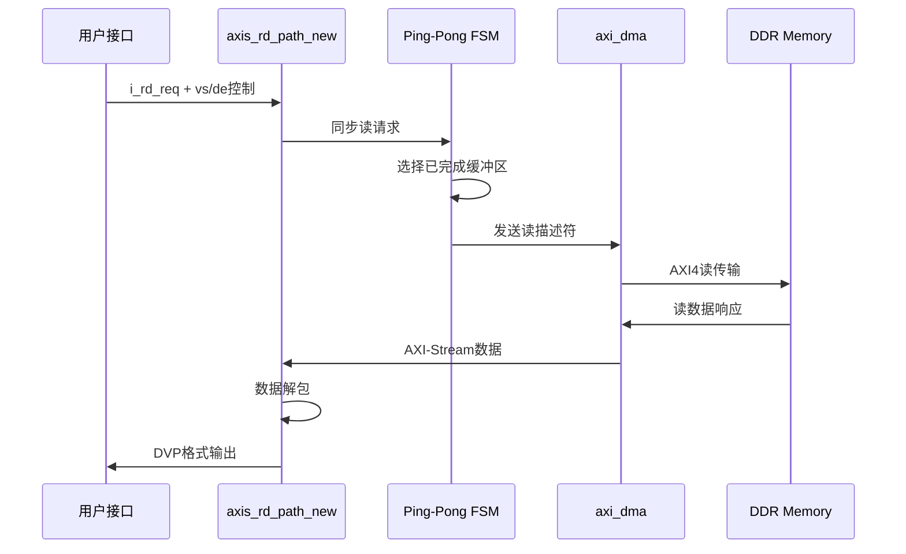

# AXI Video Bridge 模块设计文档

**版本**: 2.1  
**修订日期**: 2025-01-17  
**模块名称**: `axi_video_bridge`

---

## 1. 模块概述

### 1.1 功能描述

`axi_video_bridge` 是一个高性能的硬件视频桥接模块，实现DVP视频接口与AXI4总线之间的数据传输。该模块采用ping-pong缓冲机制，支持实时视频流的写入和读取操作，无需CPU干预即可完成帧级别的DMA传输控制。

### 1.2 主要特性

- **🔄 Ping-Pong缓冲**: 双帧缓冲机制，实现无缝视频流处理
- **⚡ 硬件自动控制**: FSM自动管理帧传输，无需软件干预
- **🌐 多时钟域支持**: 异步FIFO实现可靠的跨时钟域传输
- **📐 高度可配置**: 支持多种分辨率、数据位宽和AXI配置
- **🔌 标准接口**: 兼容AXI4和AXI4-Stream协议
- **📊 实时性能**: 支持高帧率视频处理

### 1.3 应用场景

- 视频采集系统（摄像头到DDR存储）
- 视频显示系统（DDR到显示控制器）
- 视频处理管道中的缓冲环节
- 多媒体SoC中的视频子系统

---

## 2. 系统架构

### 2.1 整体架构

`axi_video_bridge` 采用分层模块化设计，主要包含以下核心组件：

```
┌─────────────────────────────────────────────────────────────────────────────────┐
│                           axi_video_bridge (顶层控制器)                          │
│                                                                                 │
│  ┌─────────────────────┐    描述符&状态信号     ┌─────────────────────────────┐  │
│  │   Ping-Pong FSM     │◄──────────────────────►│        axi_dma              │  │
│  │   (axi_clk域)       │                        │    (verilog-axi库)         │  │
│  │ • 地址生成          │                        │                             │  │
│  │ • 标签管理          │                        │  s_axis_wr ◄─────────────┐  │  │
│  │ • 状态机控制        │                        │  m_axis_rd ──────────────┼─►│  │
│  └─────────────────────┘                        └─────────────────────────────┘  │
│           ▲                                                                      │
│           │ 同步触发                                                             │
│           │                                                                      │
│  ┌────────┼─────────────────────────────────┐    ┌─────────────────────────────┐  │
│  │        │     axis_wr_path_new            │    │     axis_rd_path_new        │  │
│  │        │                                 │    │                             │  │
│  │  ┌─────▼──────┐    ┌─────────────────┐   │    │  ┌─────────────────────────┐ │  │
│  │  │DVP→AXI转换 │───►│   异步FIFO      │───┼────┼─►│      异步FIFO           │ │  │
│  │  │(wr_clk域)  │    │wr:wr_clk        │   │    │  │wr:axi_clk, rd:rd_clk   │ │  │
│  │  │            │    │rd:axi_clk       │   │    │  │                         │ │  │
│  │  └────────────┘    └─────────────────┘   │    │  └─────────────────────────┘ │  │
│  │        ▲                                 │    │                      │      │  │
│  └────────┼─────────────────────────────────┘    └──────────────────────┼──────┘  │
│           │                                                              ▼         │
│    DVP视频输入                                                    DVP视频输出      │
│  (vs/de/data)                                                   (vs/de/data)     │
└─────────────────────────────────────────────────────────────────────────────────┘
```

### 2.2 核心组件说明

#### 2.2.1 顶层控制器 (`axi_video_bridge.v`)
- **功能**: 系统总控制器，协调各子模块工作
- **时钟域**: `axi_clk`
- **主要职责**:
  - Ping-Pong缓冲区管理
  - DMA描述符生成和状态监控
  - 跨时钟域信号同步
  - 帧传输流程控制

#### 2.2.2 写路径模块 (`axis_wr_path_new.v`)
- **功能**: DVP视频数据写入DDR的数据路径
- **时钟域**: `i_wr_clk` → `axi_clk`
- **主要职责**:
  - DVP时序信号解析(vs/de/data)
  - 像素数据打包为AXI-Stream格式
  - 异步FIFO缓冲和时钟域转换
  - 帧边界检测和控制

#### 2.2.3 读路径模块 (`axis_rd_path_new.v`)
- **功能**: 从DDR读取视频数据并输出DVP格式
- **时钟域**: `axi_clk` → `i_rd_clk`
- **主要职责**:
  - AXI-Stream数据解包为像素格式
  - DVP时序信号重建(vs/de/data)
  - 异步FIFO缓冲和时钟域转换
  - 读取流控和预缓冲管理

#### 2.2.4 DMA引擎 (`axi_dma`)
- **功能**: 执行实际的内存传输操作
- **时钟域**: `axi_clk`
- **主要职责**:
  - AXI4总线协议处理
  - 描述符驱动的DMA传输
  - 传输状态反馈
  - 突发传输优化

### 2.3 工作原理

#### 2.3.1 Ping-Pong缓冲机制

系统采用双缓冲区架构，实现无缝的视频流处理：

```
内存布局:
┌─────────────────────────────────────────────────────────────────┐
│                        DDR Memory                               │
│                                                                 │
│  ┌─────────────────────┐      ┌─────────────────────┐          │
│  │    Buffer A         │      │    Buffer B         │          │
│  │  (BASE_ADDR_A)      │      │  (BASE_ADDR_B)      │          │
│  │                     │      │                     │          │
│  │  Frame Data         │      │  Frame Data         │          │
│  │  (W×H×BPP bytes)    │      │  (W×H×BPP bytes)    │          │
│  └─────────────────────┘      └─────────────────────┘          │
│                                                                 │
└─────────────────────────────────────────────────────────────────┘

工作状态切换:
时刻T1: 写入Buffer A ←→ 读取Buffer B
时刻T2: 写入Buffer B ←→ 读取Buffer A
时刻T3: 写入Buffer A ←→ 读取Buffer B
...
```

**优势**:
- 🔄 **无缝切换**: 读写操作并行进行，无数据丢失
- ⚡ **高吞吐量**: 充分利用内存带宽
- 🛡️ **数据保护**: 避免读写冲突

#### 2.3.2 写操作流程



**关键步骤**:
1. **触发检测**: 检测`i_wr_req`上升沿
2. **缓冲区选择**: FSM选择当前空闲缓冲区
3. **数据转换**: DVP格式→AXI-Stream格式
4. **时钟域转换**: `i_wr_clk` → `axi_clk`
5. **DMA传输**: 自动处理AXI4协议
6. **状态更新**: 完成后切换缓冲区状态

#### 2.3.3 读操作流程



**关键步骤**:
1. **请求同步**: 跨时钟域同步读请求
2. **缓冲区选择**: 选择包含完整帧的缓冲区
3. **预缓冲**: 提前读取数据到FIFO
4. **时序重建**: 重建vs/de/data时序
5. **数据输出**: 按DVP时序输出像素数据

---

## 3. 接口说明

### 3.1 时钟与复位接口

| 信号名 | 方向 | 描述 | 说明 |
|---------|------|------|------|
| `axi_clk` | I | AXI总线时钟 | 系统主时钟，驱动DMA和控制逻辑 |
| `axi_rst_n` | I | AXI总线复位 | 低有效异步复位 |
| `i_wr_clk` | I | 写时钟 | 用户写接口时钟域 |
| `i_wr_rstn` | I | 写复位 | 低有效异步复位 |
| `i_rd_clk` | I | 读时钟 | 用户读接口时钟域 |
| `i_rd_rstn` | I | 读复位 | 低有效异步复位 |

### 3.2 用户写接口 (DVP视频输入)

| 信号名 | 方向 | 位宽 | 描述 |
|---------|------|------|------|
| `i_wr_req` | I | 1 | 写请求信号，在帧开始前拉高 |
| `i_wr_data_vs` | I | 1 | 垂直同步信号，整帧期间保持高电平 |
| `i_wr_data_de` | I | 1 | 数据使能信号，有效像素时为高 |
| `i_wr_data` | I | DVP_DATA_WIDTH | 像素数据，在de高电平时有效 |

**使用说明**:
```verilog
// 写操作时序示例
always @(posedge i_wr_clk) begin
    if (frame_start_condition) begin
        i_wr_req <= 1'b1;        // 在帧开始前拉高请求
        i_wr_data_vs <= 1'b1;    // 垂直同步开始
    end
    
    if (pixel_valid) begin
        i_wr_data_de <= 1'b1;    // 数据使能
        i_wr_data <= pixel_data; // 像素数据
    end else begin
        i_wr_data_de <= 1'b0;
    end
    
    if (frame_end_condition) begin
        i_wr_data_vs <= 1'b0;    // 垂直同步结束
        i_wr_req <= 1'b0;        // 清除请求
    end
end
```

### 3.3 用户读接口 (DVP视频输出)

| 信号名 | 方向 | 位宽 | 描述 |
|---------|------|------|------|
| `i_rd_req` | I | 1 | 读请求信号，在需要输出帧时拉高 |
| `i_rd_data_vs` | I | 1 | 输出垂直同步控制信号 |
| `i_rd_data_de` | I | 1 | 输出数据使能控制信号 |
| `o_rd_data_vs` | O | 1 | 输出垂直同步信号 |
| `o_rd_data_de` | O | 1 | 输出数据使能信号 |
| `o_rd_data` | O | DVP_DATA_WIDTH | 输出像素数据 |

**使用说明**:
```verilog
// 读操作时序示例
always @(posedge i_rd_clk) begin
    if (display_frame_request) begin
        i_rd_req <= 1'b1;        // 请求输出新帧
        i_rd_data_vs <= 1'b1;    // 开始垂直同步
    end
    
    if (pixel_output_enable) begin
        i_rd_data_de <= 1'b1;    // 启用像素输出
        // 模块会自动输出 o_rd_data_vs/de/data
    end else begin
        i_rd_data_de <= 1'b0;
    end
    
    if (frame_output_complete) begin
        i_rd_data_vs <= 1'b0;    // 结束垂直同步
        i_rd_req <= 1'b0;        // 清除请求
    end
end
```

### 3.4 AXI4主接口

模块提供完整的AXI4主接口，用于与DDR控制器通信：

#### 3.4.1 写通道
- `m_axi_aw*`: 写地址通道
- `m_axi_w*`: 写数据通道  
- `m_axi_b*`: 写响应通道

#### 3.4.2 读通道
- `m_axi_ar*`: 读地址通道
- `m_axi_r*`: 读数据通道

### 3.5 状态与中断接口

| 信号名 | 方向 | 描述 |
|---------|------|------|
| `frame_done_wr` | O | 写帧完成信号 |
| `frame_done_rd` | O | 读帧完成信号 |

*   **`WR_WAIT_STATUS`**: 等待DMA完成。
    *   **转移条件**: `m_axis_write_desc_status_valid == 1'b1` 且 `m_axis_write_desc_status_tag` 与发送的`tag`匹配。
    *   **动作**:
        1.  产生单周期的 `frame_done_wr` 信号。
        2.  检查返回的状态，若有错误可置位相应的错误标志。
        3.  进入 `WR_IDLE` 状态。

#### 3.4. 读控制FSM (`axi_clk`域)

读控制FSM与写控制FSM结构和逻辑完全对称，但操作的是读通道、读指针和读请求信号。

#### 3.5. 写数据路径 FSM (`axis_wr_path_new` in `i_wr_clk` domain)

*   **`IDLE`**: 等待帧的开始。
    *   **转移条件**: `i_wr_data_vs && i_wr_data_de && i_wr_req`。
    *   **动作**: 进入 `ACTIVE_FRAME`。

*   **`ACTIVE_FRAME`**: 采集和打包像素。
    *   **持续动作**: 只要 `i_wr_data_de == 1'b1`，就将 `i_wr_data` 采集并打包成 `AXI_DATA_WIDTH` 的数据字，写入异步FIFO。在帧的最后一个数据字上置位`tlast`。
    *   **转移条件**: `!i_wr_data_vs` (帧结束)。
    *   **动作**: 返回 `IDLE`。

#### 3.6. 读数据路径 FSM (`axis_rd_path_new` in `i_rd_clk` domain)

*   **`IDLE`**: 等待启动信号。
    *   **转移条件**: `frame_read_start == 1'b1`。
        *注: `frame_read_start`是一个从`axi_clk`域同步过来的单周期脉冲，由顶层读FSM在发送读描述符后产生。*
    *   **动作**: 进入 `REQUEST_DATA`。

*   **`REQUEST_DATA`**: 请求数据。
    *   **动作**: 使能FIFO读 (`rd_fifo_en = 1'b1`)。
    *   **转移条件**: `!rd_fifo_empty` (FIFO中有数据)。
    *   **动作**: 锁存FIFO的输出数据和`tlast`，进入 `UNPACK_WORD`。

*   **`UNPACK_WORD`**: 解包数据字。
    *   **动作**: 逐像素地将锁存的数据字通过`o_rd_data`输出，同时控制`o_rd_data_de`。
    *   **转移条件1 (帧未结束)**: 当前数据字已解包完且锁存的`tlast`为0。返回 `REQUEST_DATA`。
    *   **转移条件2 (帧结束)**: 当前数据字已解包完且锁存的`tlast`为1。返回 `IDLE`，并结束`o_rd_data_vs`和`o_rd_data_de`。

#### 3.7. 错误处理
*   **FIFO 溢出 (`overflow_wr`)**: 当 `axis_wr_path_new` 的异步FIFO已满 (`wr_full`为高) 但仍有新的数据需要写入时，该信号置位。
*   **FIFO 下溢 (`underflow_rd`)**: 当 `axis_rd_path_new` 的异步FIFO已空 (`rd_empty`为高) 但仍尝试读取数据时，该信号置位。
*   **DMA 传输错误**: 当 `axi_dma` 返回的描述符状态不是 'OKAY' (例如 `SLVERR` 或 `DECERR`) 时，顶层控制FSM应捕获此状态，并可以置位一个持久的错误标志（未在接口中定义，但可在内部实现）。

---

### 4. 接口定义

| 端口名称                   | 方向   | 位宽 (bits)      | 描述                                |
| -------------------------- | ------ | ---------------- | ----------------------------------- |
| **Clock & Reset**          |        |                  |                                     |
| `axi_clk`                  | Input  | 1                | AXI总线和核心逻辑时钟               |
| `axi_rst_n`                | Input  | 1                | AXI总线和核心逻辑异步复位，低有效   |
| `i_wr_clk`                 | Input  | 1                | 用户写接口时钟                      |
| `i_wr_rstn`                | Input  | 1                | 用户写接口复位，低有效              |
| `i_rd_clk`                 | Input  | 1                | 用户读接口时钟                      |
| `i_rd_rstn`                | Input  | 1                | 用户读接口复位，低有效              |
| **User Write Interface**   |        |                  |                                     |
| `i_wr_req`                 | Input  | 1                | 用户写DDR请求，在VSYNC期间有效      |
| `i_wr_data_vs`             | Input  | 1                | 场同步信号 (帧有效期间为高)         |
| `i_wr_data_de`             | Input  | 1                | 数据使能信号 (像素有效期间为高)     |
| `i_wr_data`                | Input  | `DVP_DATA_WIDTH` | 像素数据                            |
| **User Read Interface**    |        |                  |                                     |
| `i_rd_req`                 | Input  | 1                | 用户读DDR请求，在VSYNC期间有效      |
| `o_rd_data_vs`             | Output | 1                | 场同步输出 (帧有效期间为高)         |
| `o_rd_data_de`             | Output | 1                | 数据使能输出 (像素有效期间为高)     |
| `o_rd_data`                | Output | `DVP_DATA_WIDTH` | 像素数据输出                        |
| **AXI4 Master Interface**  |        |                  | (所有AXI端口直通内部的`axi_dma`)    |
| `m_axi_[aw|w|b|ar|r]...`   | I/O    | ...              | 标准AXI4主端口信号                  |
| **Status & Error Outputs** |        |                  |                                     |
| `frame_done_wr`            | Output | 1                | 一帧数据写入DDR完成（单周期脉冲）   |
| `frame_done_rd`            | Output | 1                | 一帧数据从DDR读取完成（单周期脉冲） |
| `overflow_wr`              | Output | 1                | 写路径FIFO溢出错误                  |
| `underflow_rd`             | Output | 1                | 读路径FIFO下溢错误                  |

---

### 5. 参数化配置

| 参数名称                   | 默认值       | 描述                                      |
| -------------------------- | ------------ | ----------------------------------------- |
| `FRAME_WIDTH`              | 640          | 视频帧的宽度（像素数）                    |
| `FRAME_HEIGHT`             | 512          | 视频帧的高度（行数）                      |
| `DVP_DATA_WIDTH`           | 16           | 用户视频接口的像素数据位宽                |
| `AXI_DATA_WIDTH`           | 256          | AXI总线的数据位宽                         |
| `AXI_ADDR_WIDTH`           | 32           | AXI总线的地址位宽                         |
| `AXI_ID_WIDTH`             | 4            | AXI事务ID位宽                             |
| `AXI_BURST_LEN`            | 64           | AXI突发长度（`axi_dma`内部使用）          |
| `FRAME_BUFFER_BASE_ADDR_A` | 32'h10000000 | 乒乓缓冲A在DDR中的物理基地址              |
| `FRAME_BUFFER_BASE_ADDR_B` | 32'h12000000 | 乒乓缓冲B在DDR中的物理基地址              |
| `FIFO_ADDR_WIDTH`          | 12           | 异步FIFO的地址位宽（深度 = 2^ADDR_WIDTH） |
| `TAG_WIDTH`                | 8            | DMA描述符标签位宽                         |

---

### 6. 使用指南

1.  **参数配置**: 在实例化模块时，必须根据具体的视频格式、AXI系统配置和内存映射，正确设置上述所有参数。
2.  **IP集成**: 确保 `axi_video_bridge`、`axis_wr_path_new`、`axis_rd_path_new`、`async_fifo` 以及 `verilog-axi` 库的源文件都被包含在项目中。
3.  **系统连接**:
    *   将`m_axi_*`接口连接到AXI Interconnect或直接连接到内存控制器。
    *   提供正确的时钟和复位信号。
    *   **关键**: 用户逻辑必须在希望进行DDR传输的帧期间，将`i_wr_req`或`i_rd_req`置为高电平。模块仅在`vsync`上升沿检测到`req`为高时才会启动DMA。

---

### 7. 验证策略

1.  **单元测试**:
    *   **`axis_wr_path_new`**: 使用不同频率的`i_wr_clk`和`axi_clk`进行测试，验证数据打包和异步FIFO的正确性，确保无数据丢失。
    *   **`axis_rd_path_new`**: 模拟DMA向其写入数据，验证在不同`i_rd_clk`频率下，数据解包和视频时序生成的正确性。

2.  **集成测试**:
    *   **环境**: 搭建一个包含DUT、AXI Memory Model、视频源BFM和视频消费者BFM的完整Testbench。
    *   **乒乓操作验证**: 连续输入多帧数据，监控DMA目标地址是否在`FRAME_BUFFER_BASE_ADDR_A`和`B`之间正确切换。验证`frame_done`信号的产生时机。
    *   **健壮性测试**: 在FIFO的临界点（接近满/空）进行测试，验证`overflow/underflow`标志。模拟AXI总线上的`SLVERR`或`DECERR`，验证FSM的响应。
    *   **多参数组合测试**: 更改`FRAME_WIDTH`, `DVP_DATA_WIDTH`等参数，回归所有测试用例，确保模块的灵活性。